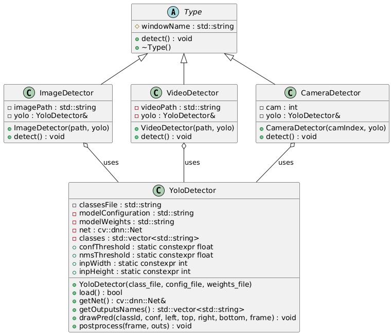

# OpenCV_CPP_Project

**Author:** [Hisham Elsayed](https://github.com/Hisham-Elsayed)

---

## Overview

OpenCV_CPP_Project is a modern C++ application demonstrating object detection using OpenCV and the YOLO (You Only Look Once) algorithm.  
The project supports detection on images, videos, and live camera feeds, using a modular, object-oriented design.

- **SOLID Principles & Design Patterns:** The codebase demonstrates SOLID OOP principles and uses patterns like Dependency Injection, Strategy, and Polymorphism.

---

> **Note:** On Windows, OpenCV logs are silenced in `main.cpp` using  
> `cv::utils::logging::setLogLevel(cv::utils::logging::LOG_LEVEL_SILENT);`  
> If you build on Linux, this line will be removed automatically.

---

## Features

- **Image Detection:** Detect objects in static images.
- **Video Detection:** Detect objects frame-by-frame in video files.
- **Real-Time Camera Detection:** Detect objects from a live camera feed.
- **Multiple YOLO Models:** Easily use different YOLO models (e.g., YOLOv4, YOLOv4-tiny) in the same run.
- **OOP Design:** Encapsulated YOLO logic, dependency injection, and polymorphic detectors.
- **Extensible:** Add new detectors or models with minimal code changes.

---

## Project Structure

```
.
├── CMakeLists.txt
├── cameraDetection.cpp/h
├── imageDetection.cpp/h
├── main.cpp
├── type.h
├── videoDetection.cpp/h
├── yoloDetection.cpp/h
├── Samples/
│   ├── Images/
│   │   ├── dog_bike_car.jpg
│   │   └── img.jpg
│   └── Videos/
│       ├── object_detection_test.mp4
│       └── Vehicle Dataset Sample 2.mp4
```

---

## Architecture

### Class Diagram (PlantUML)



### Sequence Diagram (PlantUML)


---

## Prerequisites

- **Operating System:** Windows, Linux, or macOS
- **Compiler:** C++17 compatible (MSVC, GCC, Clang)
- **CMake:** Version 3.10 or higher
- **OpenCV:** Version 4.x installed and configured
- **YOLO Files:** Place `coco.names`, `yolov4-tiny.cfg`, `yolov4-tiny.weights`, etc. in `C:\yolo\` (or update the paths in `main.cpp`)

---

## Getting Started

To clone this project, run:

```sh
git clone https://github.com/your-username/OpenCV_CPP_Project.git
cd OpenCV_CPP_Project
```
---

## Building the Project

### **On Windows (Visual Studio 2022)**

```sh
mkdir build
cd build
cmake .. -G "Visual Studio 17 2022"
cmake --build .
```

- To run the app (Debug build):
  ```
  ./Debug/opencv_cpp.exe
  ```
  Or (Release build):
  ```
  ./Release/opencv_cpp.exe
  ```

### **On Linux/macOS**

```sh
mkdir build
cd build
cmake ..
make
./opencv_cpp
```

---

## Usage

- The application will process:
  - Images from `Samples/Images/`
  - Videos from `Samples/Videos/`
  - Camera feed (if available)
- You can add or change detectors in `main.cpp` as needed.

---

## YOLO Integration

- The project uses the YOLO algorithm for object detection.
- Ensure the required YOLO config and weights files are present and the paths in `main.cpp` are correct.

---

## Contributing

Contributions are welcome! Please fork the repository and submit a pull request.

---

## Acknowledgments

- [OpenCV](https://github.com/opencv/opencv)
- [YOLOv4](https://github.com/AlexeyAB/darknet)
- The creators of the YOLO algorithm for their groundbreaking work in real-time object detection.

---